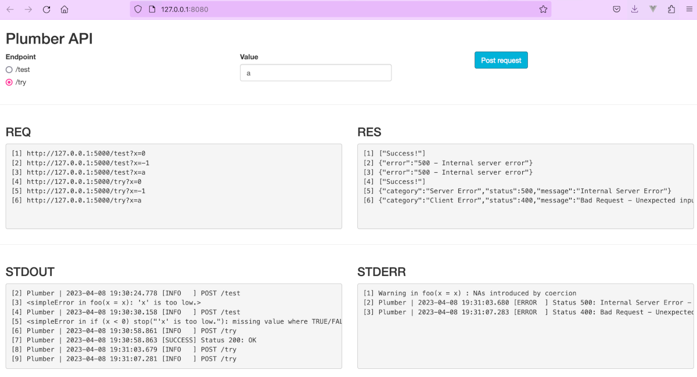
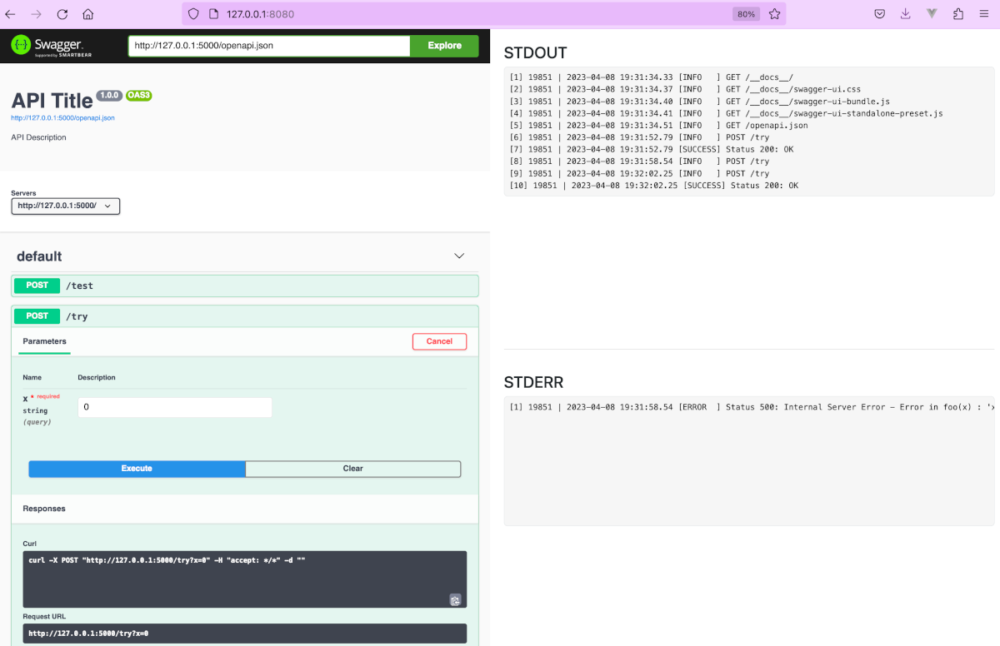

# tryr: Client/Server Error Handling for HTTP APIs

> Differentiate client errors (4xx) from server errors (5xx) with a
> simple built-in logging mechanism for the Plumber and RestRserve HTTP
> API frameworks.

``` r
remotes::install_github("analythium/tryr")
```

In client/server setups, the client might send user input that is
incorrect. In such cases the front end application needs to know that
the 4xx error status indicates that the message needs to be relayed to
the user to correct the input.

As opposed to this, when the server fails due to unexpected reasons, the
client only needs to know that an error with 5xx status happened. Logs
are essential for backend developers to diagnose the problem.

## Problem statement

The Plumber R package implements a simple error catching hook that
converts all responses that are an error condition to a status code
500 - Internal Server Error.

Let’s see this for an example API:

``` r
plumber::pr("inst/examples/plumber.R") |>
  plumber::pr_set_debug(FALSE) |>
  plumber::pr_run(port=8000)
```

### Default behavior

We use a handler calling the function `foo()`: note that the contents of
the response also depend on the `pr_set_debug()` settings that depends
on whether we use interactive or non-interactive session. This is now
turned off so that we can see the ‘production’ behavior.

``` r
foo <- function(x) {
  x <- as.numeric(x)
  if (x < 0)
    stop("'x' is too low.")
  "Success!"
}

#* @post /test
function(x) {
  foo(x = x)
}
```

Here are the responses from this `/test` endpoint for various
specification of the `x` parameter:

    # --- Request ---
    # curl -X POST "http://localhost:8000/test?x=0"
    # --- Response ---
    # ["Success!"]
    # --- STDOUT ---
    # 
    # --- STDERR ---

    # --- Request ---
    # curl -X POST "http://localhost:8000/test?x=-1"
    # --- Response ---
    # {"error":"500 - Internal server error"}
    # --- STDOUT ---
    # <simpleError in foo(x = x): 'x' is too low.>
    # --- STDERR ---

    # --- Request ---
    # curl -X POST "http://localhost:8000/test?x=a"
    # --- Response ---
    # {"error":"500 - Internal server error"}
    # --- STDOUT ---
    # <simpleError in if (x < 0) stop("'x' is too low."): missing value where TRUE/FALSE needed>
    # --- STDERR ---
    # Warning in foo(x = x) : NAs introduced by coercion

    # --- Request ---
    # curl -X POST "http://localhost:8000/test?x="
    # --- Response ---
    # {"error":"500 - Internal server error"}
    # --- STDOUT ---
    # <simpleError in foo(x = x): argument "x" is missing, with no default>
    # --- STDERR ---

As you can see, the response has a generic 500 HTTP status irrespective
of nature of the error. On the back end, the error is printed to STDOUT,
whereas a warning got printed to STDERR.

This default behavior is undesired for multiple reasons:

- We need to be able to differentiate 4xx and 5xx errors
- The detailed error message is helpful on the backend, but we should
  print it to STDERR instead of STDOUT

Warning: when `pr_set_debug(TRUE)` the error message itself is returned
by the response, this might contain sensitive information that we should
not leak to the client.

## Try/catch behavior

Alternatively, we can use some functions from tryr to handle these
inconveniences:

``` r
bar <- function(x) {
  x <- suppressWarnings(as.numeric(x))
  if (is.na(x))
    tryr::http_error(400L, "Unexpected input.")
  foo(x)
}

#* @post /try
function(req, res, x) {
  tryr::http_try(req, res, {
    if (missing(x))
      stop("'x' is missing", call. = FALSE)
    bar(x = x)
  })
}
```

Here are the outputs from the `/try` endpoint for the same requests as
before:

    # --- Request ---
    # curl -X POST "http://localhost:8000/try?x=0"
    # --- Response ---
    # ["Success!"]
    # --- STDOUT ---
    # 20076 | 2023-06-16 21:25:35.520 [SUCCESS] Status 200: OK
    # --- STDERR ---

    # --- Request ---
    # curl -X POST "http://localhost:8000/try?x=-1"
    # --- Response ---
    # {"category":"Server Error","status":500,"message":"Internal Server Error"}
    # --- STDOUT ---
    # 
    # --- STDERR ---
    # 20088 | 2023-06-16 21:25:36.586 [ERROR  ] Status 500: Internal Server Error - Error in foo(x) : 'x' is too low.

    # --- Request ---
    # curl -X POST "http://localhost:8000/try?x=a"
    # --- Response ---
    # {"category":"Client Error","status":400,"message":"Bad Request - Unexpected input."}
    # --- STDOUT ---
    # 
    # --- STDERR ---
    # 20100 | 2023-06-16 21:25:37.661 [ERROR  ] Status 400: Bad Request - Unexpected input.

    # --- Request ---
    # curl -X POST "http://localhost:8000/try?x="
    # --- Response ---
    # {"category":"Server Error","status":500,"message":"Internal Server Error"}
    # --- STDOUT ---
    # 
    # --- STDERR ---
    # 20112 | 2023-06-16 21:25:38.735 [ERROR  ] Status 500: Internal Server Error - Error : 'x' is missing

Now we can see that:

- Successful response (200) leaves a trace in STDOUT
- We can differentiate 4xx and 5xx errors
- When the error is 5xx, the error message is not included
- The detailed error message is printed to STDERR

So how did we do it? Here is what you get in tryr: we used `http_try()`.
It is a wrapper that can handle *expected* and *unexpected* errors.
Expected errors give the desired HTTP statuses using `http_error()`.
Unexpected error are returned by `stop()` and we have very little
control over those (i.e. these were written by someone else).

## Implementation

The logic inside `http_try()` is this:

*If we catch an error:*

- the error is a clear server error coming from `stop()`
  - log it as an ERROR + print the error message to STDERR
  - return a generic status 500 message
  - set the status code of the response object to 500
- the error is a structured HTTP error coming from `http_error()`
  - log it as an ERROR with the message from the condition attribute
  - return the specific HTTP error code with the structured output
  - set the status code of the response object

*If we don’t catch an error:*

- the object is of class `http_success()` (this comes in handy for async
  jobs and redirects)
  - log it as a SUCCESS with the message element
  - return the specific HTTP status code with the structured output
  - set the status code of the response object
- the object is NOT of class `http_success()`
  - log it as a SUCCESS with a generic 200 message
  - return the object as is (default status code 200 assumed)

Log messages are handled by the `msg` function. Here is how you can add
a preroute hook: we add a logger to print incoming request info (HTTP
method and route) to STDOUT. For the sake of better ingesting the logs
we can set the logging type to JSON (or CSV) and the timestamp precision
to 6 digits.

``` r
Sys.setenv(
  TRYR_LOG_FORMAT = "JSON",
  TRYR_LOG_DIGITS = "6"
)
plumber::pr("inst/examples/plumber.R") |>
  plumber::pr_set_debug(FALSE) |>
  plumber::pr_hooks(
    list(
      preroute = function(data, req, res) {
        tryr::msg(
          title = paste(
            method = req$REQUEST_METHOD, 
            path = req$PATH_INFO
          ),
          level = "INFO"
        )
      }
    )
  ) |>
  plumber::pr_run(
    port = 8000,
    quiet = TRUE)
```

Output:

    # --- Request ---
    # curl -X POST "http://localhost:8000/try?x=0"
    # --- Response ---
    # ["Success!"]
    # --- STDOUT ---
    # {"pid":"20125","ts":"2023-06-16 21:25:39.785617","ut":1686972339.78558,"level":"INFO","value":3,"title":"POST /try","message":""}
    # {"pid":"20125","ts":"2023-06-16 21:25:39.814874","ut":1686972339.81485,"level":"SUCCESS","value":4,"title":"Status 200: OK","message":""}
    # --- STDERR ---

    # --- Request ---
    # curl -X POST "http://localhost:8000/try?x=-1"
    # --- Response ---
    # {"category":"Server Error","status":500,"message":"Internal Server Error"}
    # --- STDOUT ---
    # {"pid":"20137","ts":"2023-06-16 21:25:40.861506","ut":1686972340.86146,"level":"INFO","value":3,"title":"POST /try","message":""}
    # --- STDERR ---
    # {"pid":"20137","ts":"2023-06-16 21:25:40.892093","ut":1686972340.89207,"level":"ERROR","value":6,"title":"Status 500: Internal Server Error","message":"Error in foo(x) : 'x' is too low."}

    # --- Request ---
    # curl -X POST "http://localhost:8000/try?x=a"
    # --- Response ---
    # {"category":"Client Error","status":400,"message":"Bad Request - Unexpected input."}
    # --- STDOUT ---
    # {"pid":"20149","ts":"2023-06-16 21:25:41.937577","ut":1686972341.93753,"level":"INFO","value":3,"title":"POST /try","message":""}
    # --- STDERR ---
    # {"pid":"20149","ts":"2023-06-16 21:25:41.972471","ut":1686972341.97245,"level":"ERROR","value":6,"title":"Status 400: Bad Request - Unexpected input.","message":""}

    # --- Request ---
    # curl -X POST "http://localhost:8000/try?x="
    # --- Response ---
    # {"category":"Server Error","status":500,"message":"Internal Server Error"}
    # --- STDOUT ---
    # {"pid":"20161","ts":"2023-06-16 21:25:43.01552","ut":1686972343.01547,"level":"INFO","value":3,"title":"POST /try","message":""}
    # --- STDERR ---
    # {"pid":"20161","ts":"2023-06-16 21:25:43.047822","ut":1686972343.0478,"level":"ERROR","value":6,"title":"Status 500: Internal Server Error","message":"Error : 'x' is missing"}

Structured errors are handled by the `http_error()` function that uses
default error messages as defined in the `http_status_codes` data frame.

The `http_success()` works similarly but it does not produce an error.
It can also pass a `body` argument. This is useful if we need to return
simple status messages when responding to webhooks during async
execution.

The `http_response()` can be used for any of the status codes and is
behind the `http_handler()` function that is useful to set default
handlers for Plumber:

``` r
plumber::pr("inst/examples/plumber.R") |>
  plumber::pr_set_debug(FALSE) |>
  plumber::pr_set_404(
    function(req, res) {
      tryr::msg(
        title = paste0(
          "Status 404: ", 
          tryr::http_status_codes["404", "message"]),
        level = "INFO"
      )
      tryr::http_handler(req, res, 404L)
    }
  ) |>
  plumber::pr_set_error(
    function(req, res, err) {
      tryr::msg(
        title = paste0(
          "Status 500: ", 
          tryr::http_status_codes["500", "message"]),
        message = err,
        level = "ERROR"
      )
      tryr::http_handler(req, res, 500L)
    }
  ) |>
  plumber::pr_hooks(
    list(
      preroute = function(data, req, res) {
        tryr::msg(
          title = paste(
            method = req$REQUEST_METHOD, 
            path = req$PATH_INFO
          ),
          level = "INFO"
        )
      }
    )
  ) |>
  plumber::pr_run(
    port = 8000, 
    quiet = TRUE)
```

## See the action

The `inst/examples` folder contains Shiny apps that you can edit and use
to explore the differences between Plumber’s default error handling
(`/test` endpoint) and the tryr approach (`/tryr` endpoint). See the
response, request, STDOUT and STDERR from the calls:

``` r
source("inst/examples/app.R")
```



The second app is more general. You can edit the `plumber_fun` function
definition and explore your own API’s output printed to STDOUT and
STDERR:

``` r
source("inst/examples/explore.R")
```



## Supported API frameworks

- [plumber](https://www.rplumber.io/): the most popular API framework
  for R accounting for more than 95% of the total downloads.
- [RestRserve](https://restrserve.org/): the second most popular
  framework accounting for 2% of the total downloads. See the
  [`RestRserve.R`](inst/examples/RestRserve.R) example.

[Other
frameworks](https://gist.github.com/psolymos/284b43b8dd0583b33ca7fc7dcf71082b)
(fiery, beakr, ambiorix) are not supported – using them will likely
result in an error.

## Other considerations

Similar ideas in the
[tryCatchLog](https://CRAN.R-project.org/package=tryCatchLog) package
for the general use case.

STDOUT is buffered, needs a flush. STDERR is unbuffered, more immediate
([*Do progress reports/logging information belong on stderr or
stdout?*](https://unix.stackexchange.com/questions/331611/do-progress-reports-logging-information-belong-on-stderr-or-stdout))
